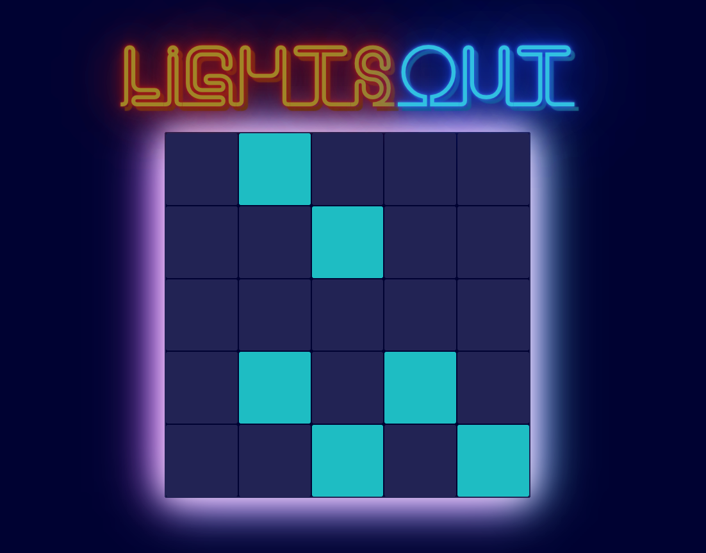
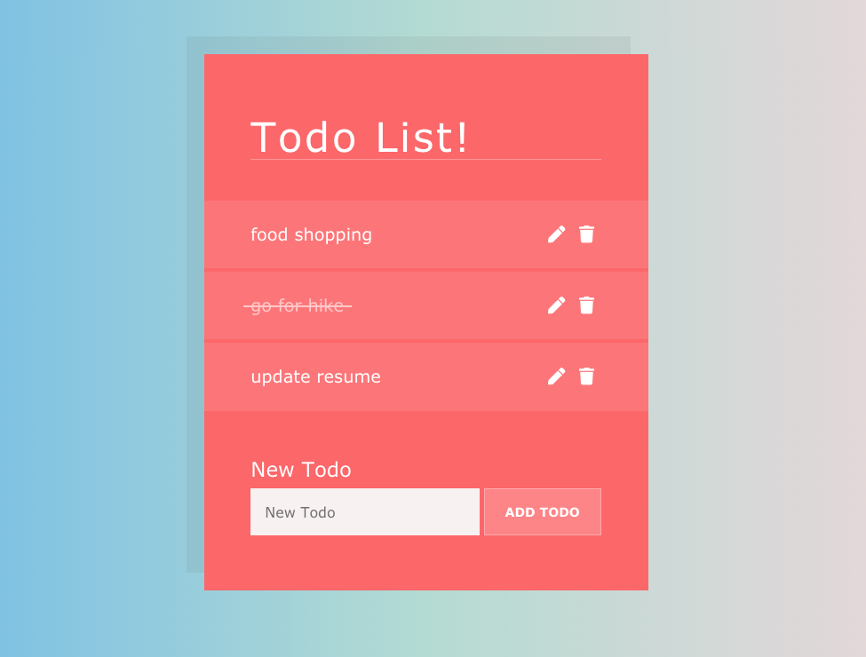
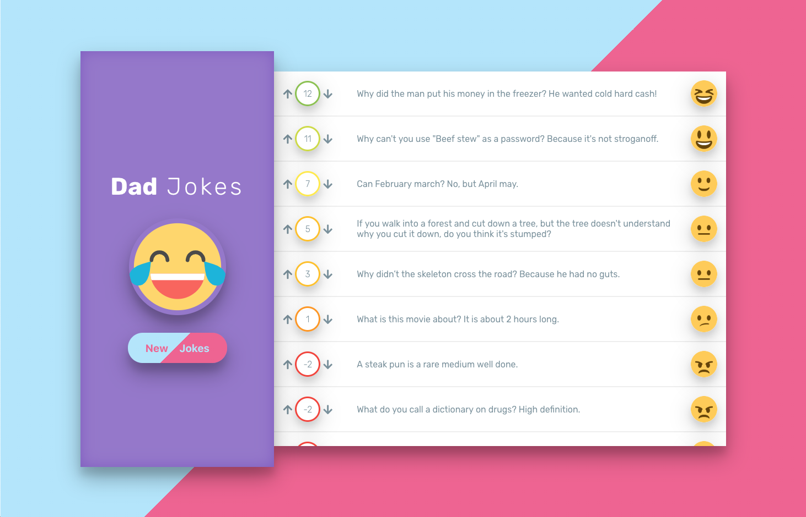
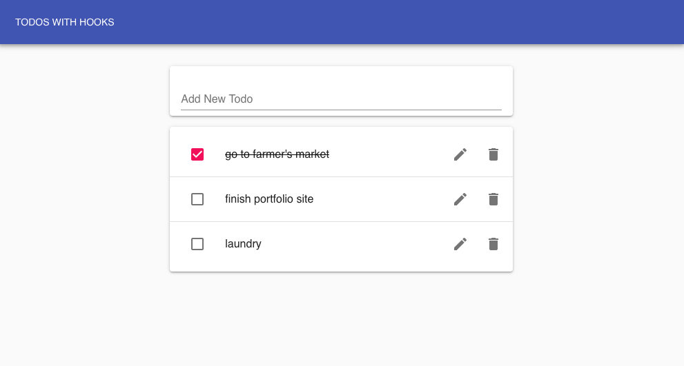

# Modern React Bootcamp

Advanced React course, project based, including topics such as Context and Hooks.  Below are a few screenshots of several projects.

 

## [Lights Out](https://lights-out-nds.netlify.com/)

Interactive game, attempt to turn off all lights on the board.

---

 

## [Todo App](https://todo-app-react-nds.netlify.com/)

Standard todo app.  Full CRUD functionality.  Local storage data persistence.

---

 

## [Yahtzee](https://yahtzee-nds.netlify.com/)

Yahtzee game.  Click on dice to freeze between rolls.  Choose appropriate score between rounds (error checking to prevent invalid scoring choice).

---

 

## [Dad Jokes](https://dad-jokes-nds.netlify.com/)

Fetch jokes from an API.  Reorder based on your ranking.  Emoji faces respond to upvote and downvote ordering.  Data persistence with local storage.

---

 

## [Todos w/ Context and Hooks](https://todos-context-hooks-nds.netlify.com/)

Another todo app, this time using Context, useReducer hook, and Material UI.  Data persistence with local storage.

